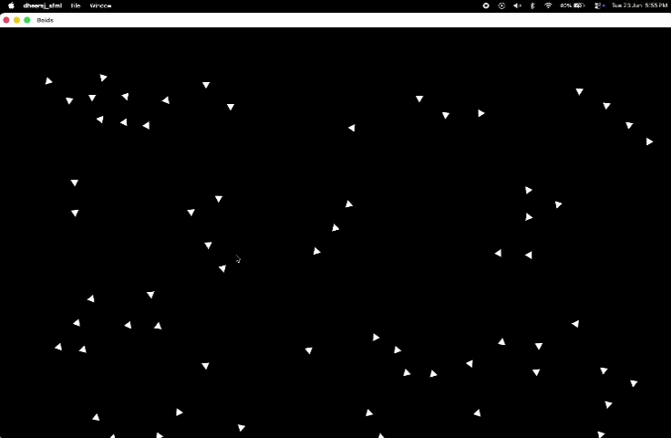

# Boids Flocking Simulation

This project is a simple implementation of the Boids algorithm using C++ and SFML.

I started this project to learn more about particle systems, vectors, and how group behaviour can emerge from a few simple rules. Instead of controlling each boid individually, every boid follows the same set of rules and the flock behaviour appears naturally.

## Demo

Add a GIF or screenshot here after recording the simulation.

## How It Works

Each boid is represented as a small triangle with a position and velocity.

Every frame, each boid looks at the boids around it and applies three rules:

### Separation

If another boid gets too close, the boid moves away from it to avoid crowding.

### Alignment

The boid tries to match its direction with nearby boids.

### Cohesion

The boid tries to move towards the centre of nearby boids so that the flock stays together.

The steering forces generated by these rules are combined and applied to the boid's velocity. The speed is limited so that boids do not accelerate indefinitely.

The boids are also rotated so that the triangle always points in the direction it is moving.

## Additional Features

- Edge steering to keep boids inside the window
- Speed limiting
- Random angular noise to prevent the flock from becoming completely rigid
- Triangle-based rendering using SFML shapes

## What I Learned

While building this project I learned about:

- Working with vectors for movement and steering
- Using trigonometric functions such as atan2 for orientation
- Basic simulation loops
- Object-oriented design in C++
- Using SFML for rendering and animation

I also spent some time experimenting with different values for visual range, protected range and steering factors to see how they affected the behaviour of the flock.

## Inspiration and References

The main inspiration for this project came from:

https://vanhunteradams.com/Pico/Animal_Movement/Boids-algorithm.html

I used the explanation and pseudocode from that page to understand the three boid rules and then implemented my own version in C++ using SFML.

The original Boids concept was introduced by Craig Reynolds in 1986.

## Notes

This project was mainly built as a learning exercise while exploring flocking behaviour and particle simulations.

The values used for visual range, protected range and steering factors are still experimental and have not been tuned extensively. There is definitely room for improvement, so any suggestions, feedback or ideas are welcome.

---

Created by Kakarla Dheeraj

Built using C++ and SFML.
